# EduSaaS – Database Design Documentation

> **Format:** Markdown (.md)  
> **Scope:** Academic • Administrative • Financial • HR • LMS • Exams • SaaS Billing  
> **Architecture:** Multi‑Tenant SaaS (SQL Server)

---

## 1. Vision & Design Philosophy

EduSaaS is designed as a **global‑grade educational SaaS platform** capable of serving:

- Local schools
- International schools
- Institutes
- Colleges & universities

### Core Principles

- **Multi‑Tenant by design** (Tenant‑isolated data)
- **Highly modular** (features enabled/disabled per subscription)
- **Academically flexible** (school years, terms, semesters, credits)
- **Financially robust** (fees, invoices, payments, holds)
- **Scalable & auditable** (BIGINT keys, soft deletes, audit logs)

---

## 2. High‑Level Architecture (Logical Layers)

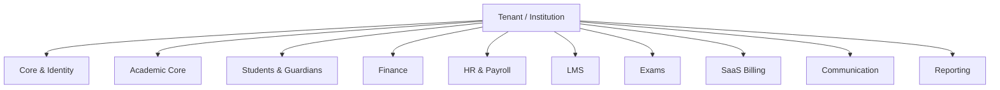

Each layer is **logically isolated** but **relationally connected** through foreign keys.

---

## 3. Multi‑Tenant Core Layer

### 3.1 Tenants

**Table:** `Tenants`

Represents a single educational institution.

Key responsibilities:
- Data isolation
- Configuration ownership
- Subscription ownership

**Key fields:**
- `TenantId`
- `Type` (school / university / institute)
- `SettingsJson`
- `Status`

All business tables reference `TenantId`.

---

## 4. Identity, Roles & Permissions

### Main Tables

- `Users`
- `Roles`
- `Permissions`
- `UserRoles`
- `RolePermissions`

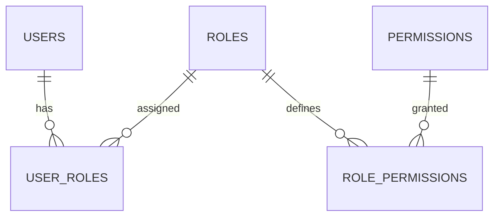

### Design Notes

- RBAC (Role‑Based Access Control)
- Roles can be tenant‑specific or global
- Permissions can be linked to SaaS features

---

## 5. Academic Structure Layer

### 5.1 Institutional Hierarchy

- `Campuses`
- `Departments`
- `Programs`

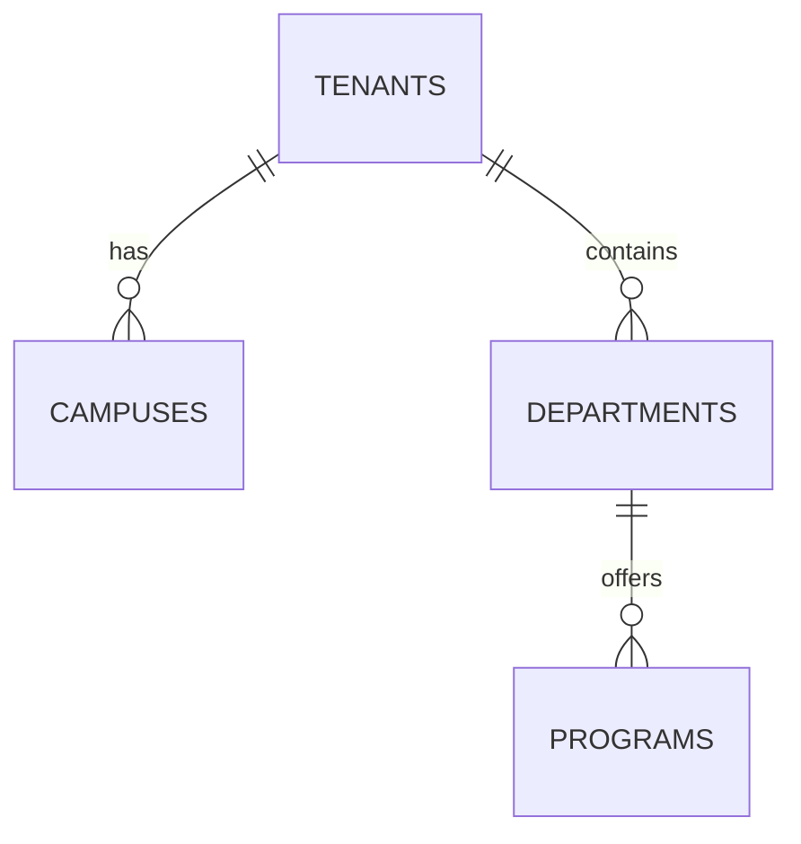

Programs abstract:
- School grades
- University majors
- Institute tracks

---

## 6. Academic Calendar & Terms

### Tables

- `AcademicCalendars`
- `AcademicTerms`

Supports:
- Annual systems
- Semester systems
- Trimester / Quarter systems

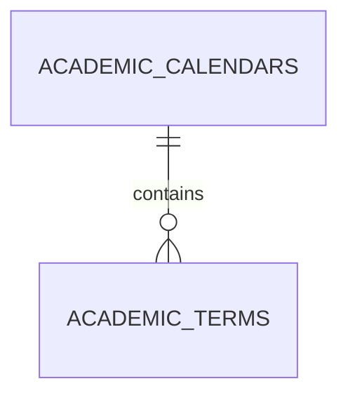

---

## 7. Students & Guardians

### Core Tables

- `Students`
- `Guardians`
- `StudentGuardians`

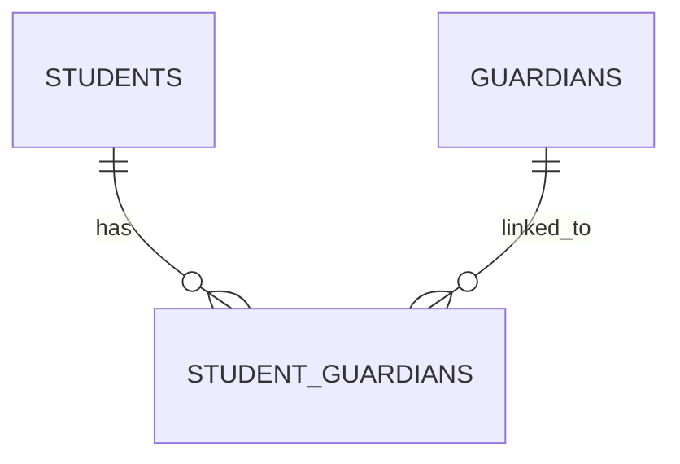

### Design Intent

- Multiple guardians per student
- Fine‑grained access control for parents
- Parent mobile application support

---

## 8. Enrollment & Academic Progress

### Tables

- `StudentEnrollments`
- `StudentCourseEnrollments`
- `StudentAcademicStatuses`
- `StudentTermGradeSummary`

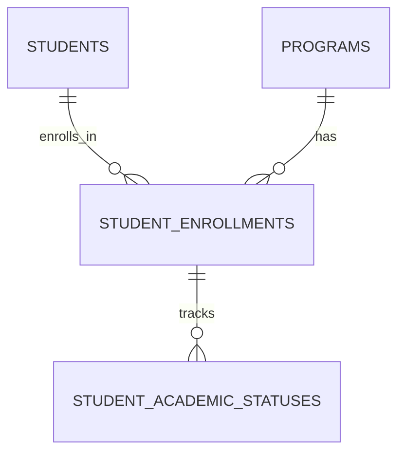

Supports:
- Promotion rules
- GPA tracking
- Credit accumulation

---

## 9. Courses, Sections & Timetables

### Tables

- `Courses`
- `ClassSections`
- `Timetables`
- `TimetableSlots`

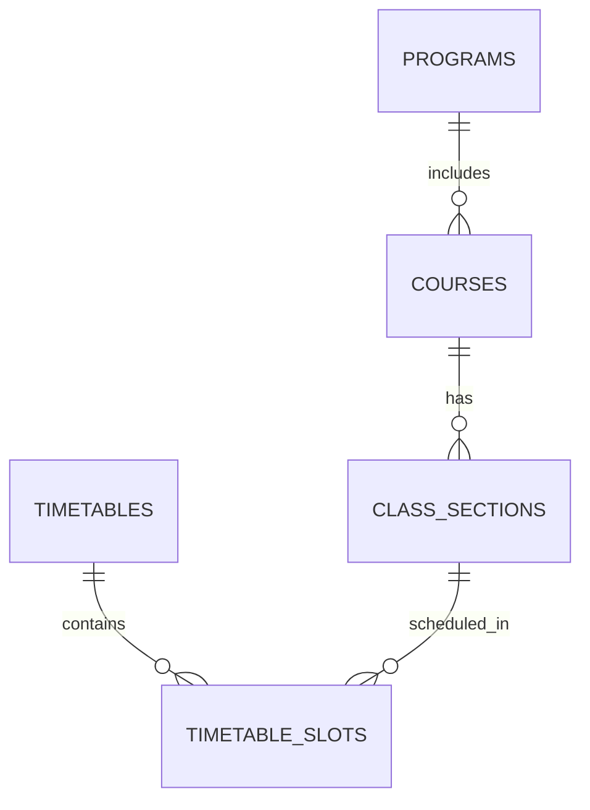

This design enables:
- Complex scheduling
- Teacher & room assignment
- Hybrid / online sessions

---

## 10. Attendance & Behavior

### Tables

- `AttendanceSessions`
- `StudentAttendance`
- `StudentDailyAttendanceSummary`
- `BehaviorIncidents`

Design goals:
- Operational attendance (OLTP)
- Fast reporting via summary tables

---

## 11. Assessment, Grading & Policies

### Tables

- `AssessmentSchemes`
- `AssessmentItems`
- `AssessmentResults`
- `FinalGrades`
- `EvaluationPolicies`
- `PromotionPolicies`

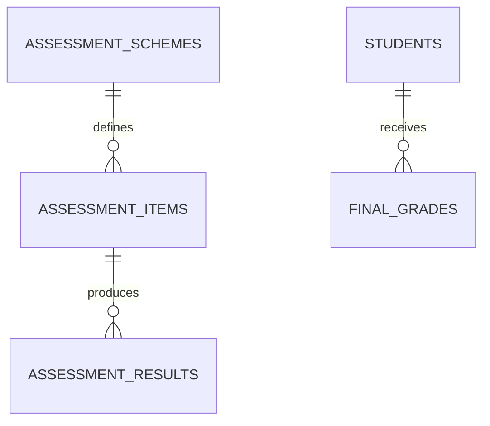

Supports:
- Local grading rules
- International GPA systems
- University credit‑based grading

---

## 12. Exam Management System

### Tables

- `ExamPeriods`
- `Exams`
- `ExamSessions`
- `ExamSeatAllocations`
- `ExamInvigilators`
- `ExamNumbers`

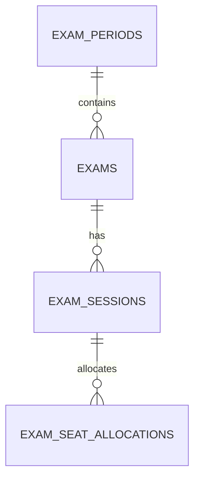

Covers:
- Official exam schedules
- Seating numbers
- Invigilation committees

---

## 13. Learning Management System (LMS)

### Tables

- `LearningModules`
- `Lessons`
- `LessonResources`
- `Assignments`
- `AssignmentSubmissions`

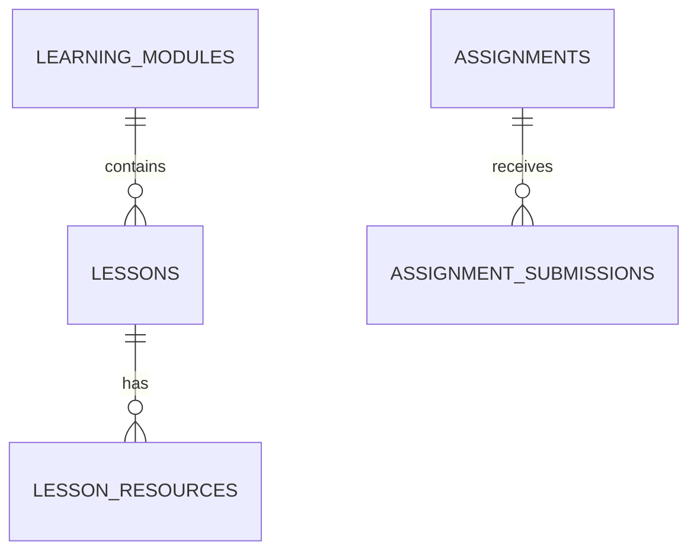

Designed to compete with:
- Google Classroom
- Moodle (core features)

---

## 14. Financial System

### Tables

- `FeeItems`
- `FeePlans`
- `FeePlanItems`
- `StudentAccounts`
- `Invoices`
- `InvoiceItems`
- `Payments`
- `FinancialHolds`

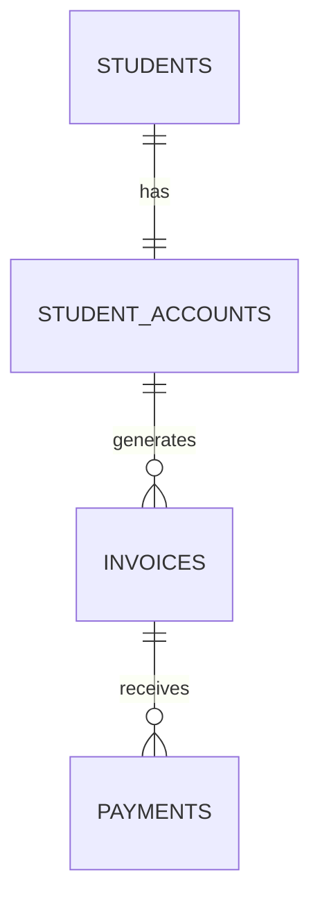

Supports:
- Schools & universities
- Course‑based billing
- Semester billing
- Financial restrictions

---

## 15. HR & Payroll

### Tables

- `Employees`
- `Positions`
- `EmployeeContracts`
- `PayrollCycles`
- `PayrollEntries`
- `PayrollEntryItems`

Design supports:
- Multiple contracts
- Allowances & deductions
- Monthly payroll cycles

---

## 16. Communication & Notifications

### Tables

- `Announcements`
- `MessageThreads`
- `MessagePosts`
- `Notifications`
- `UserDevices`

Used for:
- Parent notifications
- Teacher communication
- Student alerts

---

## 17. SaaS Subscription & Feature Control

### Tables

- `SubscriptionPlans`
- `SubscriptionFeatures`
- `SubscriptionPlanFeatures`
- `TenantSubscriptions`
- `TenantFeatureOverrides`
- `SubscriptionFeaturePermissions`

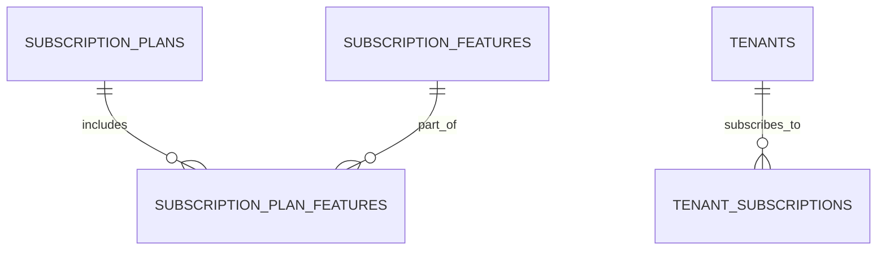

Enables:
- Feature toggling per tenant
- Usage limits
- Enterprise customization

---

## 18. Reporting & Audit

### Tables

- `AuditLogs`
- Daily / Term summary tables

Design intent:
- Compliance
- Historical traceability
- BI‑ready reporting

---

## 19. Global Design Standards

- BIGINT primary keys
- Soft deletes via `DeletedAt`
- JSON config extensibility
- Explicit foreign keys
- Index‑ready structure

---

## 20. Conclusion

This schema is **production‑grade**, **scalable**, and **future‑proof**, suitable for:

- National education systems
- Private education enterprises
- International SaaS expansion

> EduSaaS is not just a school system — it is an **educational operating system**.

---

